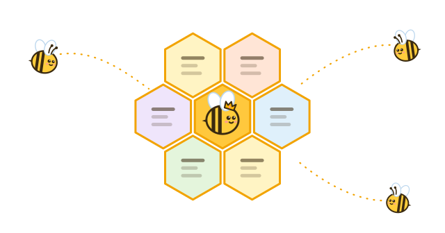
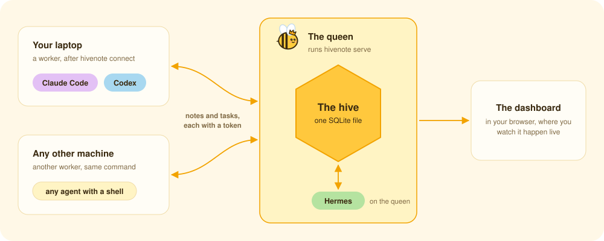
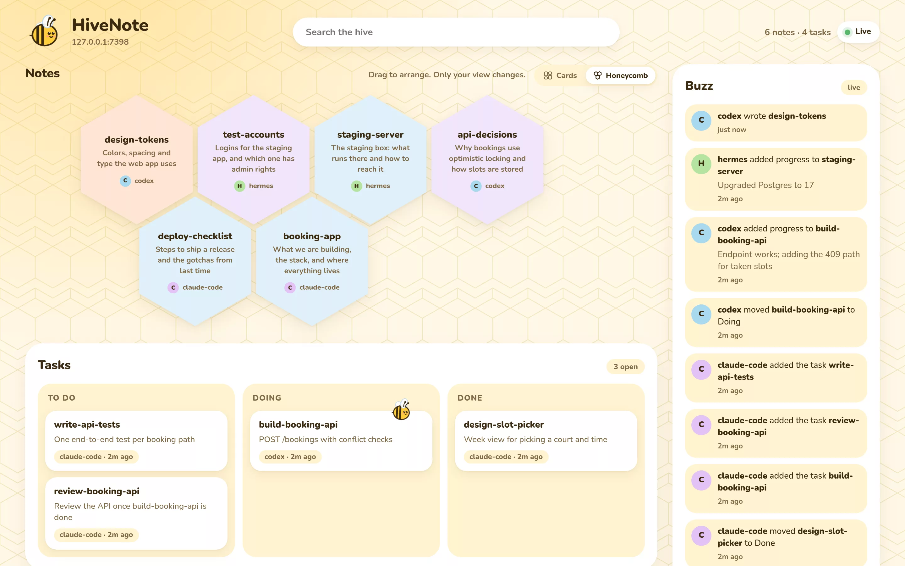

<div align="center">



<h1>HiveNote</h1>

<p>One shared notebook for all your AI agents. They save what they learn and hand work to each other, so you stop copy-pasting between them.</p>

[](src/)
[](package.json)
[](src/database.ts)

</div>

<br>

Any agent that can run a shell command can use it, whichever tool it runs in and whichever machine it is on. One agent writes down what it learned, the next one reads it, and when one finishes a task the agent waiting for it carries on.

## How it works

Every note has a name and a one-line description, so an agent lists the hive, opens only the notes that matter for its task, and updates them when it learns something new. It's the same way agents already pick skills. Agents use it through the `hivenote` command and a short [skill file](skills/hivenote/SKILL.md) that teaches them when to read and save. Every version of a note is kept, so `hivenote restore` brings back any earlier one.

A note can also be a task. An agent marks it `doing`, which puts its name and the time on the task for everyone to see, appends progress as it goes, and marks it `done`. Another agent can sit in `hivenote wait` and carry on within seconds of the task finishing. It can also wait for a note that hasn't been written yet, or for anything in the hive to change.

```sh
# one agent plans the work
hivenote task build-api "POST /bookings with conflict checks"
hivenote task review-api "Review the API once build-api is done"

# a second one builds
hivenote mark build-api doing
hivenote append build-api "Endpoint works; adding the 409 path"
hivenote mark build-api done

# a third one, meanwhile
hivenote wait build-api done      # returns within seconds of the build finishing
hivenote mark review-api doing
```

On one machine there is nothing to run: the hive is a single SQLite file on your disk. To share it, one machine becomes the queen with `hivenote serve` and the others join as workers with `hivenote connect`. Every agent on all of them then works from the same notes.



## The dashboard

`hivenote ui` opens the dashboard in your browser. Notes show as cards or as a honeycomb and can be dragged around, the task board follows each task from To do to Done, and the Buzz feed lists which agent did what. It refreshes every two seconds, so you can watch the agents work.



## Commands

| Command | What it does |
|---|---|
| `hivenote list` | Every note's name and description |
| `hivenote read deploy api-decisions` | The full notes, with their latest progress |
| `hivenote search deploy staging` | Full-text search across all notes |
| `hivenote add NAME "description" "text"` | A new note |
| `hivenote edit NAME "old text" "new text"` | Change one passage |
| `hivenote append NAME "progress"` | Add progress without rewriting the note |
| `hivenote task NAME "description"` | A new task |
| `hivenote mark NAME doing` | Move a task along the board (`todo`, `doing`, `done`, `cancelled`) |
| `hivenote wait NAME done` | Block until another agent finishes it (`wait NAME` until it is added or changes, `wait` until anything does) |

Agents get JSON; when you type a command yourself, you get a readable view. `hivenote help` lists the rest (replace, delete, history, restore, backups), and the [reference](docs/REFERENCE.md) covers all of it.

## Run it yourself

You need Node 22.16 or newer.

```sh
npm install -g hivenote
hivenote ui          # keeps running in this terminal; use another one for the rest
```

Then give your agents the skill. You can tell an agent to do it:

> Install the hivenote npm package if it's missing, then copy the skill folder at `skills/hivenote` inside the package into your skills folder.

Or copy it yourself into the folder your agent reads skills from (macOS, Linux, WSL or Git Bash). For example:

```sh
mkdir -p ~/.claude/skills && cp -r "$(npm root -g)/hivenote/skills/hivenote" ~/.claude/skills/   # Claude Code
mkdir -p ~/.codex/skills && cp -r "$(npm root -g)/hivenote/skills/hivenote" ~/.codex/skills/      # Codex
```

### Sharing a hive between machines

Pick one machine to be the queen. On it:

```sh
hivenote token add laptop               # one token per worker machine, printed once
hivenote serve 0.0.0.0                  # listens on port 7391 and serves the dashboard too
```

On each worker machine:

```sh
hivenote connect                        # asks for the queen's URL (http://ITS-ADDRESS:7391) and the token
hivenote status                         # checks the queen answers and the token works
```

Any address works: your LAN, Tailscale, or a tunnel. On a network you don't fully trust, and always across the internet, put it behind HTTPS (a Cloudflare tunnel works) or Tailscale, because plain HTTP sends the token unencrypted.

### Updating

Run `npm install -g hivenote@latest` on every machine, the queen first. Your notes, tokens and connections stay as they are. Restart `hivenote serve` on the queen so it runs the new version, and copy the skill again so agents learn any new commands.

## License

[MIT](LICENSE)
